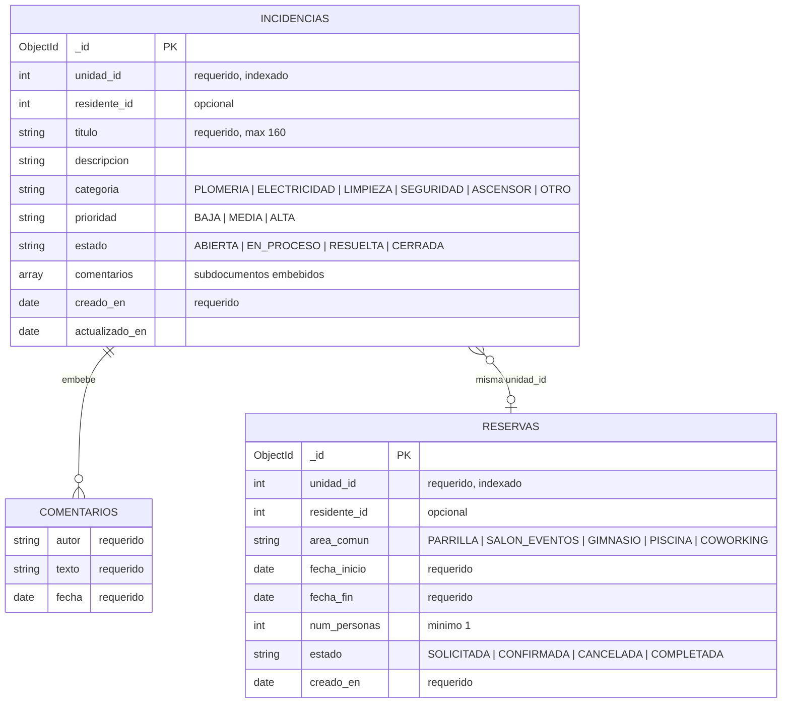

# Modelo de datos — ms-incidencias

Base: **MongoDB 7** · `condominio_incidencias`

Al ser una base **NoSQL orientada a documentos** no hay un ER clasico: no
existen claves foraneas ni joins. Lo que se documenta es la forma de cada
coleccion y que campos la relacionan con las demas.

## Las dos colecciones

| Coleccion | Que guarda |
|-----------|------------|
| `incidencias` | Reclamos y averias reportadas por los residentes, con su historial de comentarios embebido. |
| `reservas` | Reservas de areas comunes: parrilla, salon de eventos, gimnasio, piscina y coworking. |

Ambas se relacionan por `unidad_id`: son los reclamos y las reservas de una
misma unidad. Esa relacion, mas la de `incidencias` con sus `comentarios`
embebidos, es la que cumple el requisito del curso de tener al menos dos
colecciones relacionadas.

## Por que los comentarios van embebidos

Un comentario **no tiene sentido fuera de su incidencia**: nunca se consulta
suelto, siempre se lee junto al reclamo que lo origino. Guardarlo en una
coleccion aparte obligaria a hacer un `$lookup` en cada lectura. Embebido, la
incidencia completa se trae en una sola operacion.

Los subdocumentos se declaran con `_id: false`, porque no necesitan
identificador propio.

## Indices

| Coleccion | Indice | Para que |
|-----------|--------|----------|
| `incidencias` | `{ unidad_id: 1 }` | Listar los reclamos de una unidad. |
| `incidencias` | `{ estado: 1, creado_en: -1 }` | El tablero de reclamos abiertos, mas recientes primero. |
| `reservas` | `{ unidad_id: 1 }` | Listar las reservas de una unidad. |
| `reservas` | `{ area_comun: 1, fecha_inicio: 1 }` | Ver la agenda de un area comun. |

## Frontera con los otros microservicios

`unidad_id` y `residente_id` son **identificadores logicos** hacia
`ms-residentes`: no hay llamada HTTP a ese microservicio. Cada base es
autonoma, y MongoDB no puede verificar una referencia que esta fuera de su
alcance.

El cruce entre bases lo resuelven **ms-ficha-residente** (en linea) y
**Athena** (en diferido, sobre los datos ya volcados a S3).

El esquema de validacion de MongoDB esta en [schema.json](schema.json), y los
modelos de Mongoose que lo implementan en `src/models/`.
